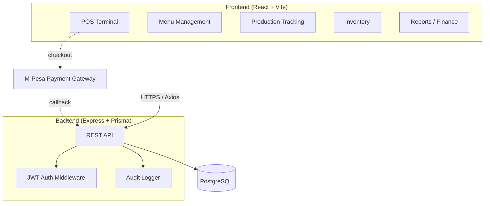
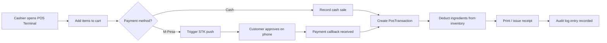
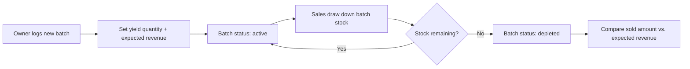

<<<<<<< HEAD
# Bakery POS
=======
# Bakery POS
>>>>>>> 76c2e8e0884e91aaeb6807861ddf091d62fd7301

A point-of-sale, inventory, and production-tracking system built for bakery operations — order taking, batch production tracking, ingredient-level inventory, supplier management, and sales reporting.

---

## Features

| Area | Capabilities |
|------|----------------|
| POS Terminal | Fast checkout, cart, receipts, cash / M-Pesa payment |
| Menu Management | Product catalog, categories, pricing, availability toggling |
| Production Tracking | Log baking batches, track yield vs. sold, auto-flag depleted stock |
| Inventory | Ingredient stock levels, reorder thresholds, recipe-based auto-deduction on sale |
| Suppliers | Supplier records, stock-in movements, purchase tracking |
| Reporting | Revenue summary, expenses, receipts, audit log of all mutating actions |
| Access Control | Owner and Cashier roles, JWT-secured sessions |

---

## Tech stack

| Layer | Technologies |
|-------|----------------|
| Frontend | React 18, Vite, TypeScript, Tailwind CSS, React Router, Axios |
| Backend | Node.js, Express, TypeScript, Prisma ORM, JWT, Bcrypt |
| Database | PostgreSQL |

---

## System architecture



---

## Core flow: sale transaction



---

## Core flow: production batch lifecycle



---

## Local setup

### Prerequisites
- Node.js v18+
- PostgreSQL

### Backend
```bash
cd backend
npm install
cp .env.example .env   # set DATABASE_URL, DIRECT_URL, JWT_SECRET
npx prisma db push
npm run db:seed
```

### Frontend
```bash
cd frontend
npm install
npm run dev             # http://localhost:5173
```

Backend runs at `http://localhost:5000` via `npm run dev` inside `backend/`.

---

## Project structure

```text
bakery-pos/
├── backend/
│   ├── prisma/schema.prisma
│   ├── routes/
│   └── services/
├── frontend/src/
│   ├── pages/
│   │   ├── pos/
│   │   ├── inventory/
│   │   └── finance/
│   └── components/
```

---

## Database commands

```bash
cd backend
npm run db:generate    # Regenerate Prisma client
npm run db:push        # Apply schema to database
npm run db:seed        # Seed default users & sample data
npm run db:studio      # Prisma Studio GUI
```

---

## Roadmap

- [x] Baseline POS terminal, menu, inventory, production tracking
- [ ] Owner / Cashier role split finalized
- [ ] Bakery-specific unit types (piece / loaf / kg / dozen)
- [ ] Stale/best-before tracking on production batches
- [ ] Branding pass (logo, receipt template, color theme)

## License

Proprietary — all rights reserved.
